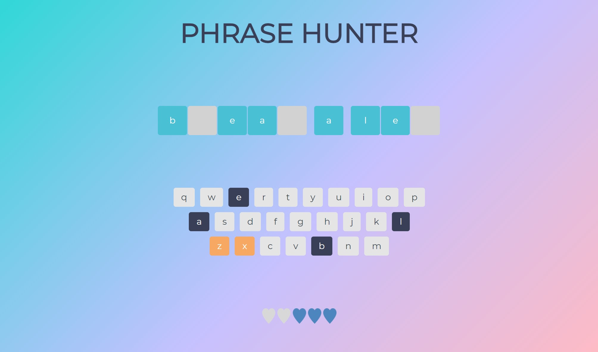

# Class-based JavaScript Word Game

To play: 
- Use the app on [GitHub Pages](https://xyeres.github.io/oop-game-v2/)
- Or download files and open index.html in your browser.

Additional features include: 
- More robust key bindings, making sure that any non-alpha key strokes are ignored via regex and key code bindings.
- If you are at the overlay screen (first boot or at a win/loss screen) you can simply hit the `Enter` key to start a new game
- I have customized the background color on the load screen, game screen, win and loss screen to make it feel more snazzy

